% The Jackson Pad: DIY Vibration Damping for Drumsets

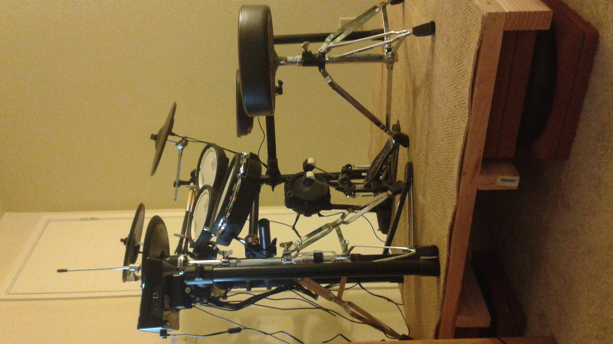

After moving into an apartment, I wanted to make sure my drumming wouldn't bother
neighbors, so I bought an electronic set and ditched the acoustic one. Not so long
after, I received my first ever noise complaint!

It turns out that even with an electronic set, a lot of energy is transmitted into
the floor on which it's sitting. Vibrations carry from the drum when struck, into
the stand, and into the floor. But moreover, the action of a foot triggering
a pedal mirrors the same action a person would make when stomping, so of course
that's going to annoy a downstairs neighbor.

# Options to decrease vibrations

The most straightforward way to decrease the vibrations that are transmitted
through the floor is to decrease the energy associated with each drum hit.
For example, use [beaterless pedals](https://www.amazon.com/Yamaha-KU100-Beaterless-Silent-Pedal/dp/B00FI2PE1U).
If there's no beater imparting energy into kick drums that's sitting directly
on the floor, that's obviously going to result in less energy transmitted into
the floor.
Similarly, the high hat for my electronic set mimicks the motions of an acoustic hat:
pedal action physically moves the top hat up or down, and when I slam the high-hat
closed, that's a sudden transfer of momentum from the top hat, into the high-hat
stand, and into the floor.
Beaterless pedals solve both these issues.

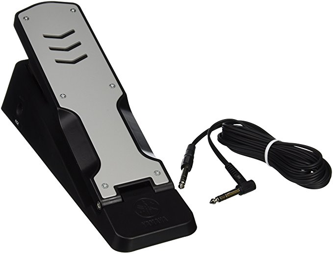

But, maybe you've already sacrificed enough in the move from acoustic to electronic,
and beaterless pedals don't do much to stop vibrations from the stomping motion
or from hitting the other drums.

There are off-the-shelf products aimed specifically to solve this issue,
so-called [drum noise elimination podiums](https://www.thomann.de/gb/thomann_drum_noise_elimination_podium.htm).

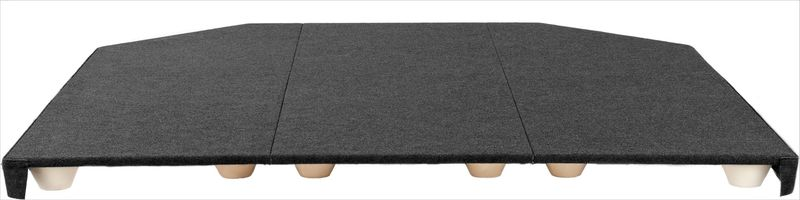

Or you can place the set atop a riser.

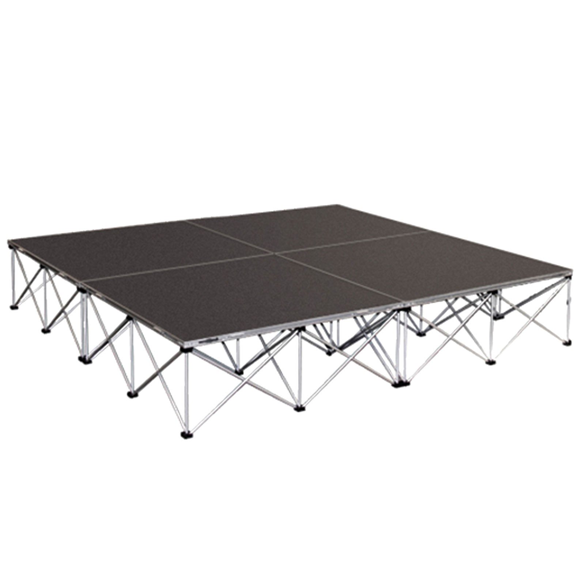

I have to say I was very tempted by that Thomann podium, but it was priced a bit aggressively.

Cheaper options include placing the set on a big rubber or foam pad, similar
to what you might put under a washing machine or an exercise bike ("anti vibration mats").

But the drummer forums really pushed me towards DIY solutions, with not a lot of
success stories from using anti-vibration mats. Maybe that's just a bias the people
on these forums have, and anti-vibration mats work equally well, but I was
intrigued and I researched more.

# DIY solutions

The most infamous DIY approach within these drum communities is the *tennis ball riser*:
Sandwich tennis balls between two large panels (or a panel and the floor), put the drumset
on top, and you're done. It's a simple suspension system, and actually resembles that
commercial Thomann podium quite a bit.

A more thoroughly engineered solution I came across was *The Jackson Pad*. The
creator (Brian Jackson) provided detailed build instructions, some convincing
noise measurements, a believable theory of operation, and I couldn't find anyone
who tried this *without* success.

# The Jackson Pad

Initially proposed [over on vdrums.com](https://www.vdrums.com/forum/advanced/diy/1095500-new-design-impact-isolating-platform-plans-and-guide),
I've mirrored the original [design document](Jackson Pad - Design Drawings - 2-10-2015.pdf)
and [build instructions](The Jackson Pad - R1 - Illustrated Builders Guide.doc).

The first idea is that the drumset should sit atop a platform that has a lot of mass.
Because of the high mass, the momentum you impart onto it when stomping your feet
causes less physical displacement than a platform with low mass.

The second idea is to set this new platform atop four air-filled inner tubes.
The displacement of the platform will compress the air within the tubes, simultaneously
transforming mechanical energy into heat energy (compressing a gas causes it to heat),
and redirecting some of the motion outward instead of downward. The heat will be transformed
back into mechnical energy as the pressures balance, but the effect is that sharp impulses
of mechanical energy are imparted into the floor over a greater period of time.
It's like applying a low-pass filter to the actual sound of a foot stomping.

My understanding in this area is unfortunately weak (so take my explanation with a grain of salt),
but of all the solutions I could find, this one had the most reasonable theory of operation to me.

# Construction

Building the pad is pretty straightforward. The stock 4'x4.7' design is just large enough
for a typical 4-drum + highhat + ride + crash + kick configuration with a stool that
doesn't have a huge footprint.

Unfortunately, it's just large enough to also not be practical to move around in a car.
I tend to move places every year or two, so I needed to find a way to make it fit in
my stationwagon.

The stock plan is makes use of four 55.5" trusses which support fourteen 2x4s running
perpindicular to them.

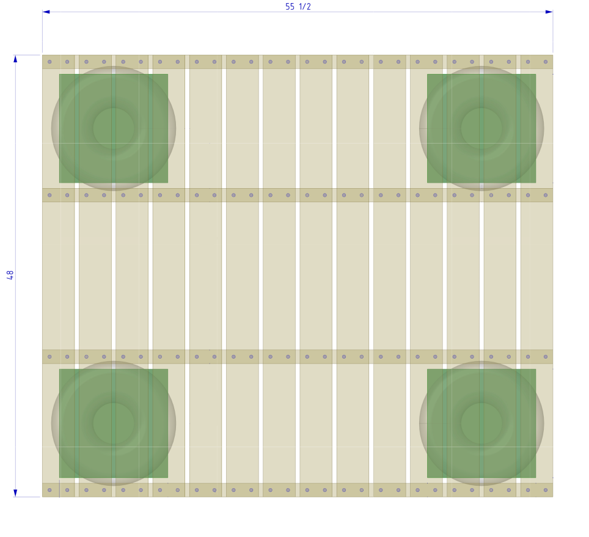

I decided to make a vertical cut down the center of this entire design such that
I would have two separate 48"x27.25" pads.
Each truss would be cut in half, and then the two halves of each truss would
be secured by bolting them to a brace. With the bolts in place, you're left with
a solid 48"x55.5" pad; with the bolts removed, you have two smaller pads that can
be easily transported.

Here's what the new truss + brace system looks like:

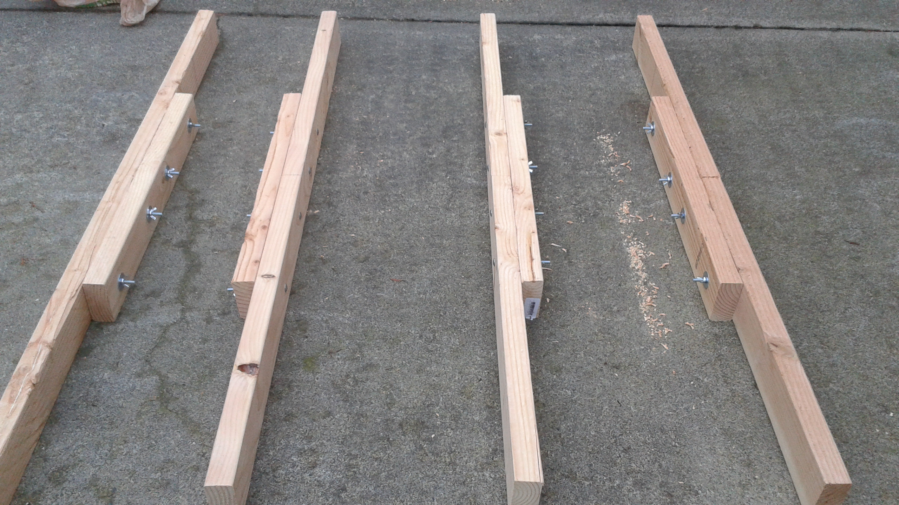

When constructing the platform, keep the bolts in place and secure the 2x4s atop
each truss as normal (make sure to screw them into the trusses, and _not_ the braces)!

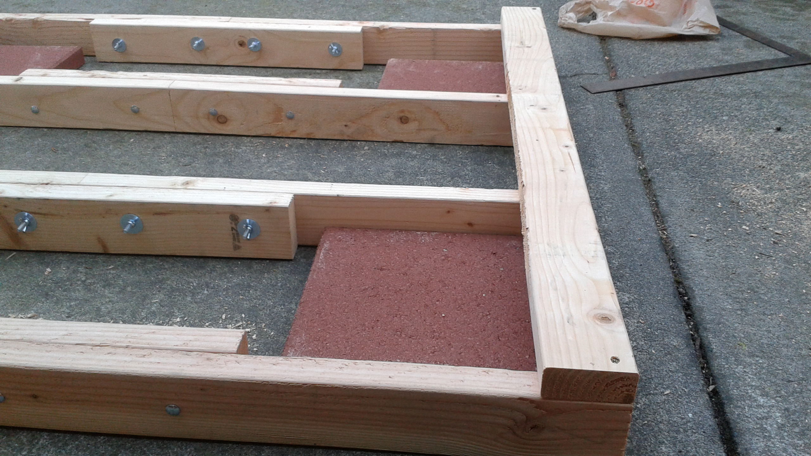

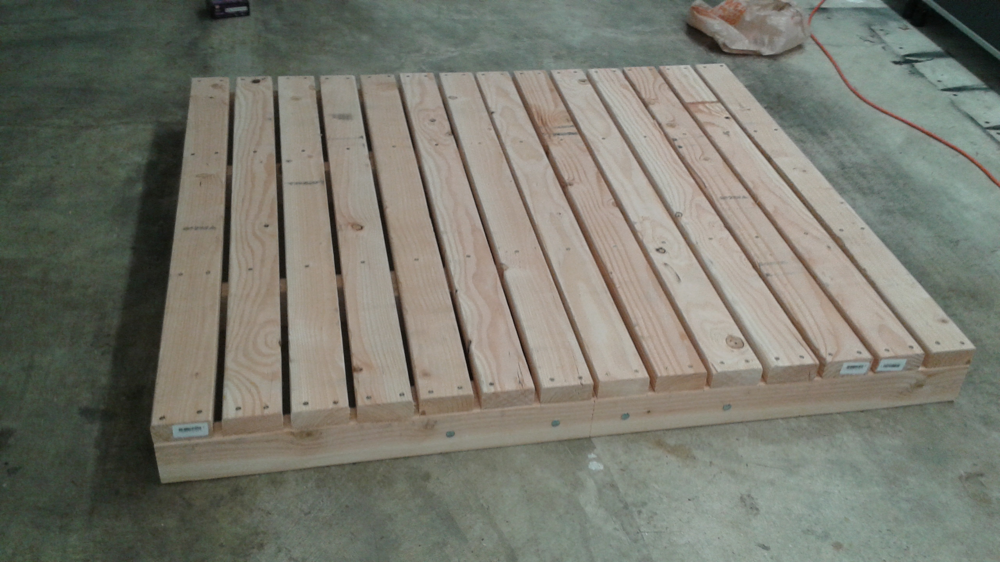

Here's what it looks like from the underside:

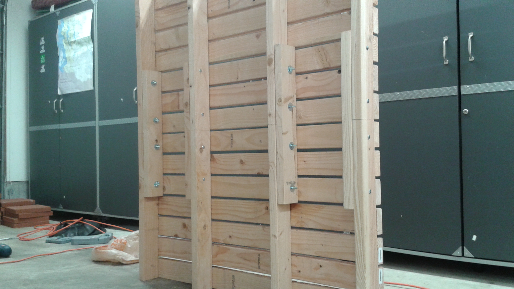

If you want to put a carpet on it, do that now.
At this point, it will make sense to label the braces so that you know which one
belongs to each truss whenever you need to reassemble them (even though they should
all be the same, in practice you won't have lined up the holes identically in each
one). I figured an easy way to make sure I paired each brace with the correct truss
was to make it so they spell out a word when correctly paired.

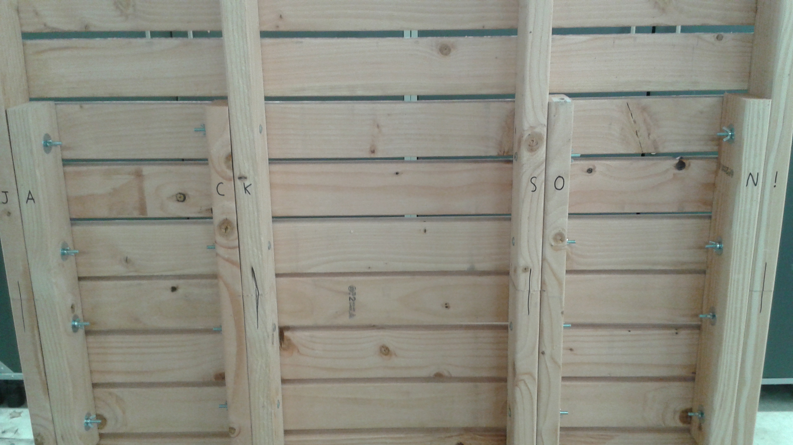

Now remove the braces, and it's easy to transport. I decided to carpet the entire thing
instead of each piece individually. That means the pieces only fold instead of being fully
separable - and it requires two people to carry it - but it probably looks nicer when assembled.

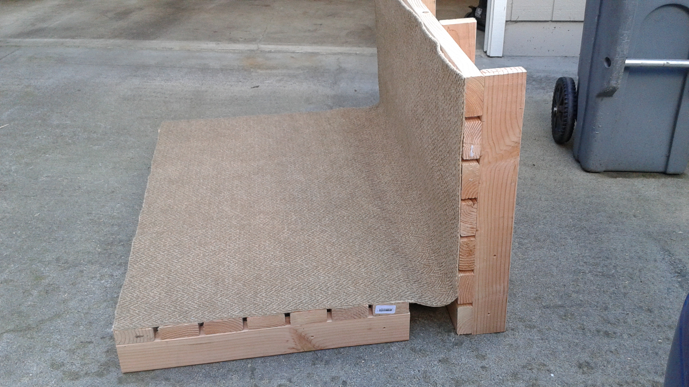

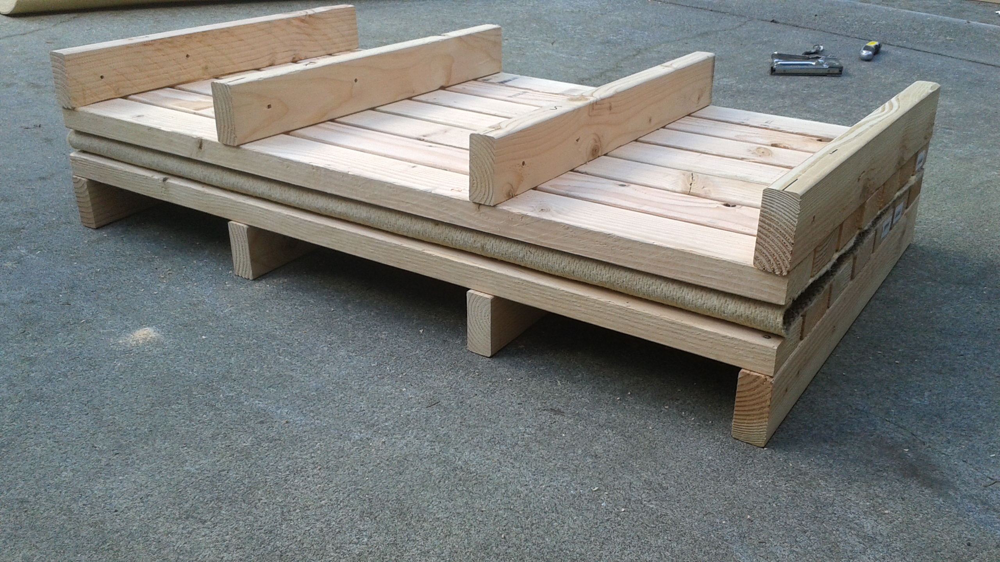

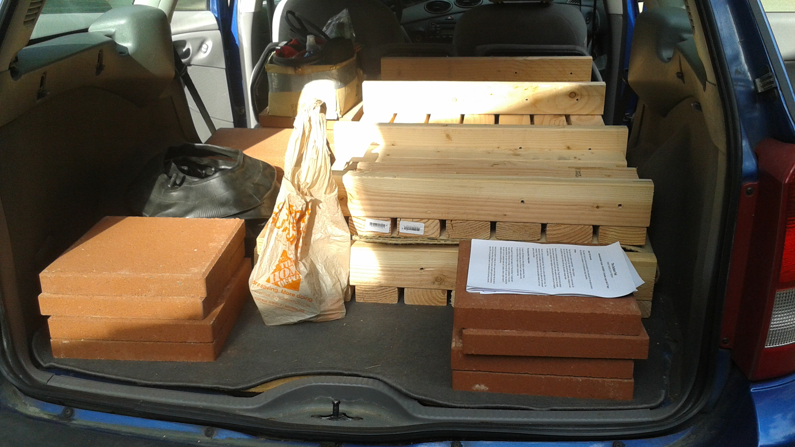

To setup the pad somewhere more permanent, first situate the isolation pedestals, then reattach the braces and lower the pad onto the pedestals.

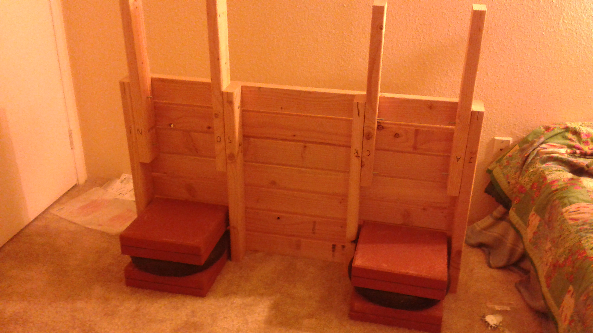

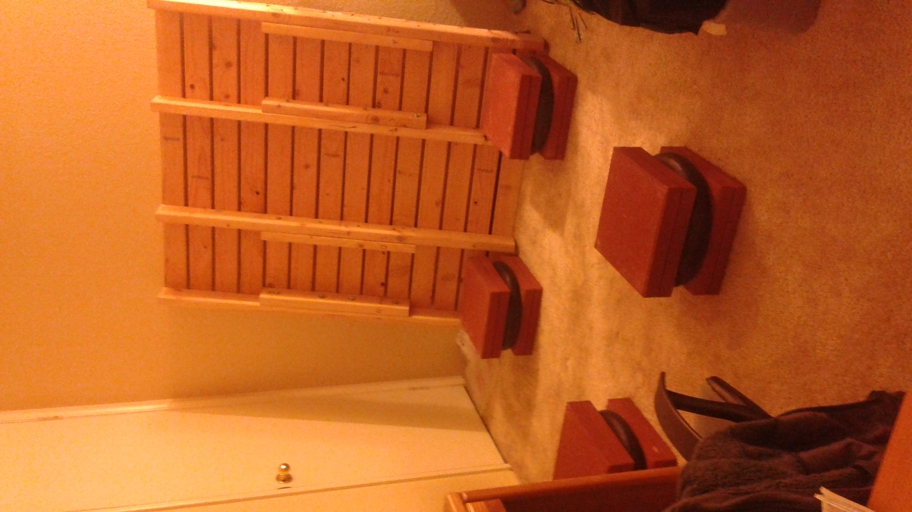

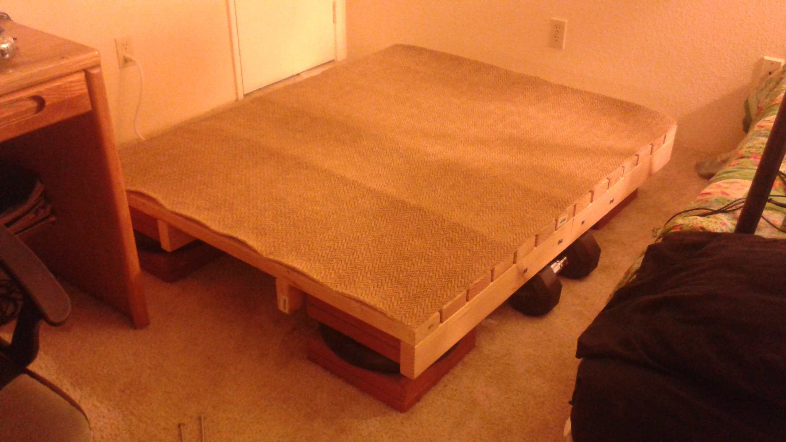

And you're good to go :)

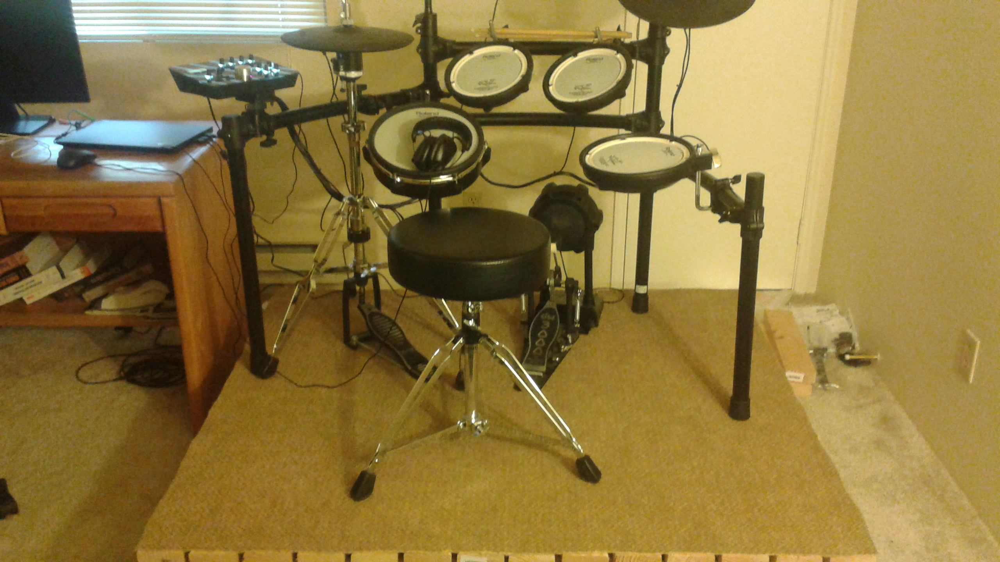
